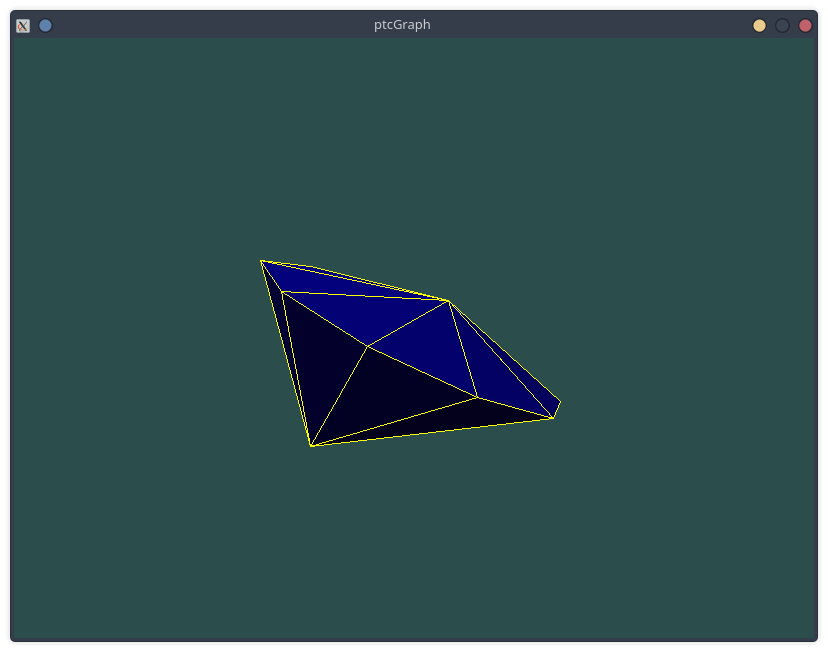

# ptcGraph examples

Examples for the *ptcGraph* unit, made by me or others.

## See also

- [Baby Chess](https://github.com/rchastain/baby-chess)
- [Cairo examples](https://github.com/rchastain2/cairo-examples/tree/main/pascal/ptcgraph)
- [Fiveline](https://github.com/RetroNick2020/fiveline)
- [Ghost Invasion (Pac-Man clone)](https://gitlab.com/rchastain/ghost-invasion)
- [Nero 5](https://gitlab.com/rchastain/nero5)
- [Russian Checkers](https://github.com/rchastain/pascal-russian-checkers)
- [Snake for ptcGraph](https://codeberg.org/rchastain/snake-ptcgraph)
